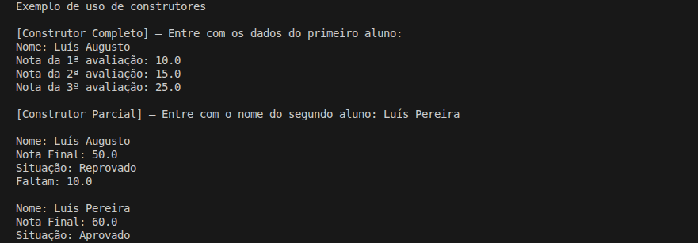

# Cáculo da Nota Final

Programa para calcular a nota final de um aluno com base nas três notas trimestrais e informar sua situação no ano letivo.

## Detalhes Gerais

- **Versão**: 0.2
- **Conceito aplicado:** Construtores

## Descrição da Tag

Evolucao da solucao orientada a objetos com introducao de construtores e sobrecarga.

A classe Aluno passa a concentrar validacoes de nome e limites das notas diretamente no construtor, garantindo consistencia do estado do objeto no momento da criacao. Foi adicionada sobrecarga permitindo criacao parcial do aluno com valores padrao. O fluxo do programa foi atualizado para demonstrar o uso dos diferentes construtores.

## Exemplo de Execução

