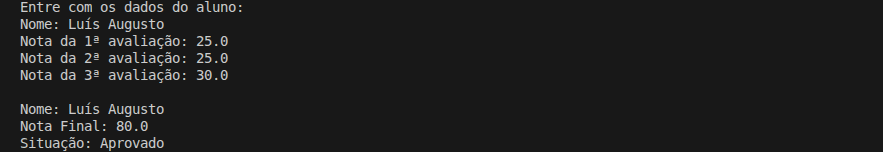

# Cáculo da Nota Final

Programa para calcular a nota final de um aluno com base nas três notas trimestrais e informar sua situação no ano letivo.

## Detalhes Gerais

- **Versão**: 0.3.1
- **Conceito aplicado:** Refatoração de Código

## Descrição da Tag

Refatoracao da classe Aluno com extracao do metodo ValidarNota para eliminar repeticao de codigo e garantir validacao consistente no construtor. O metodo Aprovacao passa a ser privado e o fluxo principal do programa e ajustado para executar diretamente SolucaoProblema.

## Exemplo de Execução

(aluno aprovado)

(aluno reprovado)

